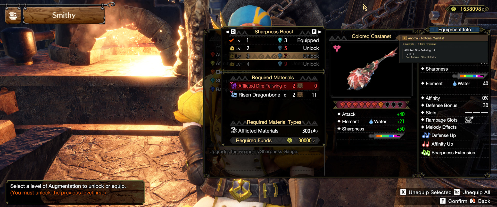

# Anomaly Material Wishlist

Keep Sunbreak's anomaly-material requirements and farming guidance in view, from the Smithy to your next hunt.

A **Monster Hunter Rise: Sunbreak PC mod for REFramework**. Enter the materials and quantities you need, then close the editor to see a compact HUD with investigation-level ranges and monster sources.

**v0.6.7 is the current working milestone and first polished Git baseline.** Development continues; this is not a finished final release. Requirements are entered manually—automatic Smithy detection is future work.



## What it does

- Keeps a persistent wishlist of material quantities with level and monster guidance.
- Provides a family-based Material Counts editor: click a name or `+` to add, `-` to subtract.
- Separates interactive editing from the passive gameplay HUD.
- Offers Rise-inspired brown/gold and Classic cyan/black styles.
- Saves window positions, sizes, and HUD text scale (0.8×–1.4×).
- Supports shared F8 visibility with participating HS overlays and optional auto-show after a save loads.
- Keeps the material database separate from Lua behavior and presentation.

Counts represent manually tracked needs. The mod does not read your inventory, detect completion, or import the Smithy's requirements automatically.

## Requirements

- Monster Hunter Rise: Sunbreak on PC.
- REFramework. The supplied development screenshots show `v1.5.6+8-654bac56`.
- REFramework-D2D for the styled passive HUD; version 1.4.1 was reported used during development.

The source includes a basic Classic drawing fallback when styled rendering is unavailable. The portfolio screenshots show the Direct2D experience. Broader dependency-version, performance, and resolution compatibility have not been established.

## Install

### Manual installation

1. Install REFramework and, for the styled HUD, REFramework-D2D for your game setup.
2. Copy this repository's `reframework/` folder into the game folder containing the executable, merging it with the existing folder.
3. Launch the game, open REFramework, and expand **Anomaly Material Wishlist** under **Script Generated UI**.

Install these three files together:

```text
reframework/
├── autorun/
│   ├── SmithyAnomaly.lua
│   └── SmithyAnomalyStyle.lua
└── data/
    └── SmithyAnomalyData.json
```

### Vortex

Build an installation ZIP containing only `reframework/` and `vortex_override_instructions.json` at its root. Import that ZIP into Vortex, enable it, and deploy. The override copies the three files to their matching paths and sets the mod type to `dinput`.

GitHub's **Download ZIP** wraps the repository in a parent directory and includes portfolio/history files. Repackage the install files as described above for Vortex; do not import the full repository archive as the mod package. The packages under `archive/` are older development snapshots.

### Updating

Replace the three distributable files together. Keep your generated `smithy_anomaly_wishlist.json` and `smithy_anomaly_settings.json`; updates retain these filenames intentionally. Back up those files if preserving your current setup is important. No personal wishlist/settings files are shipped here.

## Use

1. Load your save and open the mod's REFramework panel.
2. Keep **Enable wishlist** checked. Turn on **Visible now (F8)** or press **F8** if the wishlist is hidden; a fresh configuration starts hidden.
3. Select **Open Material Counts** and enter the quantities you need. For the example above, add two **Dire Fellwing**.
4. Close REFramework to view the passive HUD. Reopen it to edit counts, drag/resize the wishlist editor, or change display settings.
5. Select **Done** beside an item when you have fulfilled it. **Clear Entire Wishlist** opens a confirmation before clearing everything.

| Control | Behavior |
| --- | --- |
| F8 / Visible now (F8) | Toggle visibility; coordinates with participating HS overlays. |
| Auto-show after save loads | Show when a master player becomes available; hide when leaving the loaded save. This is not Smithy detection. |
| Show on script load (manual mode) | Choose initial visibility when automatic save-load behavior is off. |
| Rise-style passive HUD | Switch between Rise and Classic presentation. |
| HUD text size | Adjust and save passive text scaling. |
| Focus / reopen wishlist | Restore access to the wishlist editor. |
| Reset wishlist position / size | Restore the resolution-aware position or default editor size. |
| Reset material editor | Restore the Material Counts layout defaults. |

## Files and persistence

| File | Purpose |
| --- | --- |
| `reframework/autorun/SmithyAnomaly.lua` | Core behavior, editors, persistence, visibility, and diagnostics. |
| `reframework/autorun/SmithyAnomalyStyle.lua` | Direct2D themes, typography, geometry, scaling, and default placement. |
| `reframework/data/SmithyAnomalyData.json` | Material families, tiers, level labels, sources, and database revision. |
| `smithy_anomaly_wishlist.json` | Runtime-generated user quantities, handled through REFramework's JSON API. |
| `smithy_anomaly_settings.json` | Runtime-generated preferences and window layout. |
| `smithy_anomaly_probe_v0.6.6.json` | Runtime-generated diagnostics for the retained v0.6.6 core. |

The package milestone is **v0.6.7**, comprising the **v0.6.6 core** and **v0.6.7 style module**. The core UI and probe filename therefore still show 0.6.6. Those original version markers and file contents are preserved, not relabeled.

## Troubleshooting

- **No HUD:** check Enable wishlist, visibility/F8, and whether the list contains any positive quantities. Close REFramework for passive viewing. If auto-show is enabled, load a save.
- **No material data:** confirm the database is installed under `reframework/data/`. The **Smithy detection / diagnostics** section reports the load path, revision, and status and offers **Reload Material Database**.
- **Unexpected style or placement:** check the style-module and Direct2D status in diagnostics, select the desired theme, and use the position/size reset controls. Saved positions can survive updates.

## Development story

Read the [portfolio case study](portfolio/case-study.md) for the problem, data architecture, editing workflow, visual comparisons, and lessons from in-game iteration. The [screenshot index](portfolio/screenshot-index.md) identifies all ten original images, including superseded examples. See the [changelog](CHANGELOG.md) and [development chronology](docs/DEVELOPMENT_CHRONOLOGY.md) for the available history.

## Limits and next steps

- Automatic Smithy requirement extraction and exact Smithy-screen detection remain unresolved. A future approach could preview detected requirements with an explicit **Apply to Wishlist** action.
- The Rise-style border thickness/falloff and title outline need further refinement against native Progress panels.
- The HUD is a custom rendering inspired by Rise, not a cloned native game interface.
- The database is preserved at revision `TU5_INFOGRAPHIC_002`. Its original external attribution and redistribution terms were not recovered; no definitive source credit is asserted. See [provenance and validation](docs/BASELINE_PROVENANCE.md).

## Credits

The repository owner directed the project, made product and visual decisions, tested in game, supplied feedback, and captured the screenshots. AI assistance supported Lua implementation/refactoring, debugging, packaging, documentation, and design iteration. Monster Hunter Rise: Sunbreak and the game imagery belong to Capcom; this is an unofficial fan project.

No project license has been selected for this baseline.
