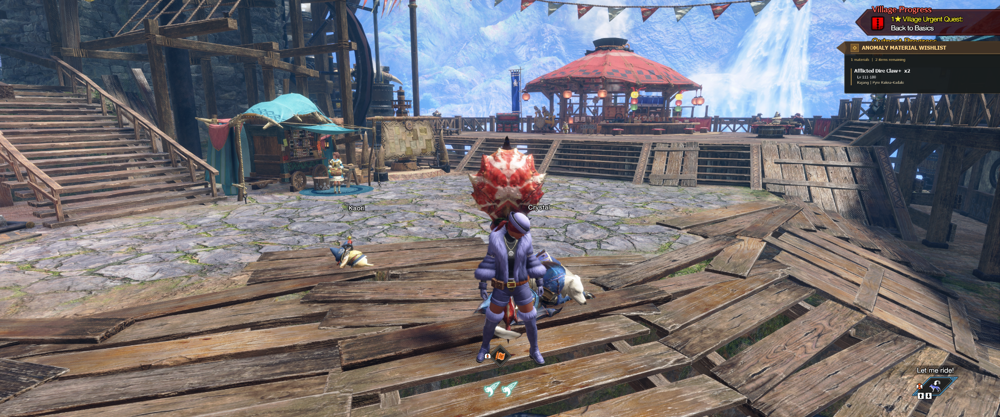
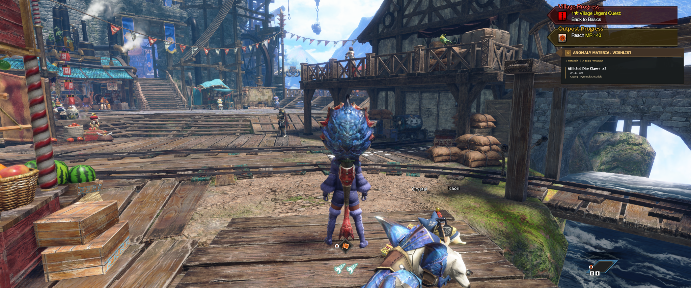
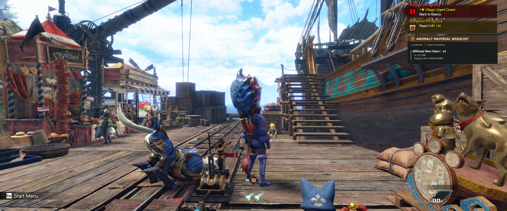

# Designing a Native-Feeling QoL Mod for Monster Hunter Rise: Sunbreak

> **Project:** Anomaly Material Wishlist
>
> **Current documented milestone:** v0.6.7
>
> **Status:** working milestone, still evolving

The visual record and archived packages focus on v0.6.3 onward. Earlier motivations are summarized from the supplied development handoff, rather than presented as a complete early history. The repository preserves the local v0.6.7 package: a v0.6.6 core and v0.6.7 style module, with their original version markers.

## Problem
Monster Hunter Rise: Sunbreak’s anomaly crafting system asks players for many similarly named afflicted materials. Each material belongs to a family, becomes available across particular investigation-level bands, and comes from particular monsters. The Smithy can tell a player *what* is missing, but that requirement is easy to lose once the player leaves the crafting screen.

The project began with a simple product question: **could the game keep the useful part of that crafting context visible while the player goes farming?**

The strongest current example is `screenshots/02_smithy_passive_hud.png`. The native Smithy shows **Afflicted Dire Fellwing ×2** with none owned. Beside it, the mod keeps the same requirement visible and adds the missing action-oriented context: **Lv 201+; Gold Rathian | Silver Rathalos**.

*The requirement is manually entered. Matching values demonstrate the workflow, not automatic extraction from the Smithy.*

## Constraints
The ideal interaction would read the Smithy’s current requirements automatically. Early REFramework probes investigated that possibility, but reliable requirement extraction and exact Smithy-state detection were not solved. Building the whole experience around an uncertain game hook would have stalled the useful part of the project.

There were additional constraints:
- anomaly-material mappings must be accurate—bad data wastes hunts;
- REFramework configuration UI is useful for editing but visually inappropriate as a permanent gameplay HUD;
- multiple custom overlays needed consistent visibility behavior rather than independently fighting over the same F8 key;
- the overlay had to remain readable over wildly different village/Smithy backgrounds;
- updates should preserve the user’s existing wishlist and settings rather than rename storage for cosmetic consistency.

## Early solution: make the manual path good
Instead of waiting for automatic Smithy detection, the project pivoted to a manual workflow that could be made fast and dependable.

A **Material Counts** editor organizes anomaly families into compact columns. Clicking a material name or `+` adds one; `-` subtracts one. The persistent wishlist then shows only active needs. Each entry carries the quantity, investigation level, and eligible monster sources. A `Done` action clears an individual completed requirement, while `Clear Entire Wishlist` handles resets.

This separation became an important interaction decision: **editing is dense and temporary; viewing is compact and persistent.** The player can configure the list while REFramework is open, then close the framework UI and keep only the information needed for the hunt.

The corrected workflow screenshot (`screenshots/01_smithy_editor_corrected_x2.png`) demonstrates the full loop: the game asks for two Afflicted Dire Fellwings, the editor records two, and the wishlist translates that need into farming guidance.

*The REFramework panel still shows core version 0.6.6, which is retained in the v0.6.7 package. An earlier screenshot showed a manually entered quantity of one; the corrected image above is the portfolio workflow reference.*

## Data architecture: separate facts from behavior
Material mappings were moved into `SmithyAnomalyData.json` rather than remaining embedded in Lua. The recovered database identifies itself as revision `TU5_INFOGRAPHIC_002` and supports both simple monster-source strings and source objects with their own level ranges.

That separation matters because data errors have real gameplay cost. During development, the Dire Wing family needed a correction: **Gold Rathian and Silver Rathalos are the sources; Bazelgeuse must not be included.** Treating the mapping as maintained data, rather than incidental UI code, made those corrections safer and more reviewable.

The Lua layer can therefore focus on loading/validating the database, maintaining counts, and rendering the experience.

## Editor and persistence
The project stores user state separately from distributable data:
- `smithy_anomaly_wishlist.json` keeps material quantities;
- `smithy_anomaly_settings.json` keeps UI preferences/positions/sizes;
- versioned probe JSON captures diagnostics during development.

Those filenames intentionally remain stable even after the public product name changed from “Smithy Anomaly Finder” to “Anomaly Material Wishlist.” Renaming internal persistence for branding would create migration risk without improving the player experience.

The editor itself evolved through in-game use. Instructions that originally occupied body space were consolidated into the window title, the default height was adjusted after a bottom action became clipped, and two overlapping position-reset controls were reduced to one resolution-aware reset. These are small changes, but they illustrate the project’s recurring process: **test in the real game context, notice friction, remove it.**

## Passive HUD and lifecycle behavior
A persistent farming list only helps if it appears at the right time and stays out of the way otherwise.

The passive HUD is hidden while REFramework’s editor UI is open and rendered during normal play. F8 toggles visibility. Because the user has multiple HS overlays, the project adopted a shared `_G.HSHotkeys` generation counter instead of letting every mod independently edge-detect F8.

Optional save-load behavior uses the presence of the master player (`snow.player.PlayerManager` / `findMasterPlayer`) as a pragmatic lifecycle signal. The HUD can remain hidden before a character loads and appear once the save is active. This is deliberately narrower than Smithy detection: it solves a real lifecycle problem without pretending the code knows which crafting screen is open.

## Native-UI visual iteration
Functionality was only half the goal. A permanent overlay that looked like a generic debug panel would compete with Rise rather than belong beside it.

Two styles were kept intentionally:
- **Classic:** a polished cyan/black presentation that remained a readable fallback/alternative.
- **Rise:** a brown/gold Direct2D treatment informed by the game’s Village Progress, Outpost Progress, Wishlist, Smithy, and Qurious Crafting UI.

### Architecture enables visual iteration
By v0.6.3, rendering had grown enough to justify splitting `SmithyAnomalyStyle.lua` from the core `SmithyAnomaly.lua`. That made typography, geometry, palette, and positioning easier to change without mixing them into persistence and game-state behavior.

The split also produced an instructive bug: v0.6.3 attempted arithmetic on the `fs` table while calculating Rise HUD height. v0.6.4 corrected those calculations to use `fs.scale`. The user tested the fix successfully. This is a useful portfolio debugging episode because the failure was not hidden—it directly informed a cleaner understanding of the style context structure.

### Placement follows the native hierarchy
The first Rise positioning pass sat too high and overlapped Village/Outpost Progress. v0.6.5 moved the default down. In-game testing then showed that vertical clearance was good but horizontal alignment still felt off. v0.6.6 shifted the default left so the rectangular body aligned more naturally with the native Progress panels.

| Earlier overlap | Intermediate placement |
| --- | --- |
|  |  |

*These originals demonstrate the placement problem and the subsequent clearance. Their exact capture versions are not established by the images alone; the version sequence comes from the development handoff.*

The same release cleaned up product naming and editor controls. The user’s response—“Not bad. Looks like it preserves the text size setting too.”—also confirmed that visual iteration had not discarded the saved 1.2× HUD scale.

### v0.6.7: typography and environmental contrast
A later village screenshot exposed a subtler issue: the brown wedge could disappear against the brown side of a boat. The native Rise panels use dark translucent perimeter treatment to keep their silhouette readable across scenery.

v0.6.7 therefore focused on visual contrast rather than adding features. The Rise heading moved from all caps to **Anomaly Material Wishlist**, title/material typography became lighter, dark text-outline treatment was explored, and a dark translucent outer silhouette was added behind the panel and wedge while preserving the brown/gold inner border.

The current village screenshot (`screenshots/03_village_passive_hud_v067.png`) shows the result beneath the native Progress panels. It also reveals the next refinement: the user noted that the outer transparent border still is not as thick as the game’s own treatment. That limitation is documented rather than edited out of the story.

*The boat-background example before the v0.6.7 contrast pass. It motivated stronger separation between the wedge and scenery.*

*Current village result. These are different scenes, not a controlled same-camera comparison; the visual direction is evident, while the remaining border mismatch is still visible.*

## Current result
v0.6.7 is the point where the project became coherent enough to establish a Git baseline and portfolio story. It combines:
- a concrete gameplay problem;
- a maintained external data model;
- a fast manual fallback where automation is not yet reliable;
- persistent state and lifecycle behavior;
- a separation between editing and passive use;
- an architecture that isolates visual styling;
- repeated visual comparison against the host game rather than styling in isolation.

The best hero image is the Smithy passive view because the problem and solution coexist in one frame: the native UI identifies the missing material, while the mod supplies the information needed to act on it.

The initial baseline preserves all four install files byte for byte from the local v0.6.7 ZIP, independently matched against the neighboring working files. Static checks establish package integrity and data structure; the historical in-game testing and screenshots provide the runtime evidence. No new in-game run or performance benchmark was performed while preparing this commit. See [provenance and validation](../docs/BASELINE_PROVENANCE.md).

## What the project demonstrates
### Product thinking
The project did not treat “automatic detection” as a prerequisite for usefulness. When the ideal hook was uncertain, scope moved toward a manual interaction that still solved the core job.

### Interaction design
Dense editing and passive viewing were separated. Visibility, save lifecycle, per-item completion, and persistent settings were refined around actual use rather than a static mockup.

### Visual judgment
The Rise theme evolved by comparing the overlay with native UI in multiple environments. Placement, hierarchy, font weight, casing, translucency, wedge silhouette, and contrast were all changed in response to in-game evidence.

### Technical implementation
The work spans REFramework Lua, external JSON data, Direct2D rendering, persistence, shared hotkey coordination, Vortex deployment, and defensive fallbacks/diagnostics.

### Iteration and debugging
Packaging failures, a Direct2D arithmetic crash, incorrect visual placement, clipped editor content, and screenshot-story mismatches were surfaced and corrected rather than omitted from the process.

## Authorship and AI collaboration
The repository owner defined the problem, made product and visual decisions, supplied/validated material mappings, repeatedly tested builds in Monster Hunter Rise, captured screenshots, identified regressions, and decided which tradeoffs were acceptable.

AI assistance was used as a collaborative implementation and documentation tool: drafting/refactoring Lua, reasoning about REFramework behavior, suggesting debugging steps, helping structure Vortex packages, comparing screenshots, and maintaining versioned iteration plans. The work should not be presented as autonomous AI authorship; the direction and acceptance criteria came from the user’s repeated in-game evaluation.

## Next steps
The current milestone is intentionally not described as finished.

1. **Automatic Smithy requirement detection.** Continue investigating game state. If reliable, preview detected requirements and require an explicit **Apply to Wishlist** action rather than silently replacing persistent state.
2. **Native-style border refinement.** Increase/refine the outer translucent silhouette to better match Rise’s Progress panels across bright and dark scenery.
3. **Header treatment.** Explore a stronger, more continuous Progress-style dark outline around the Rise title while keeping body text quieter.
4. **Continue validating material data.** Treat source/level changes as factual data updates requiring verification, and recover definitive external data attribution.

The [screenshot index](screenshot-index.md) preserves the supporting images and their limits. The [development chronology](../docs/DEVELOPMENT_CHRONOLOGY.md) records the available pre-Git context without fabricating historical commits.
