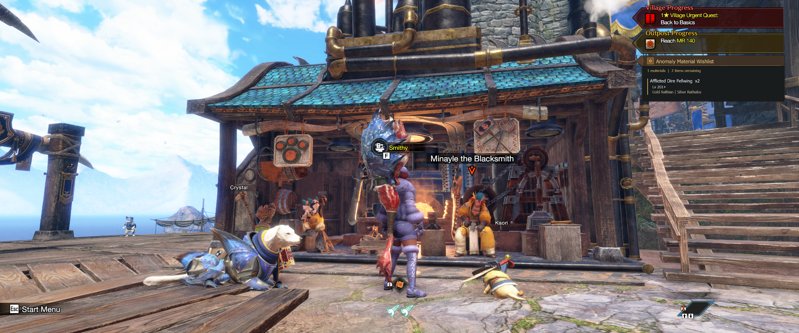
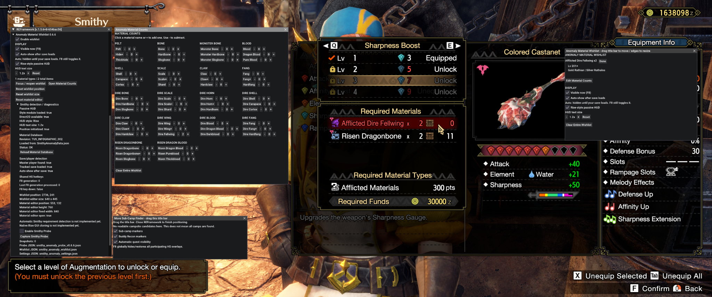

# Anomaly Material Wishlist

## Turning a momentary crafting requirement into an actionable farming plan

Monster Hunter Rise: Sunbreak tells players which anomaly materials they are missing while they are at the Smithy. Acting on that information is less direct. Once the player leaves the crafting flow, they still need to know which monsters provide the material, which Anomaly Investigation levels qualify, and how many pieces remain.

I started this project with a more ambitious question: **could a mod recognize the Smithy's requirement and tell the player exactly what to hunt?**

The first prototypes explored the game's runtime and UI hierarchy through REFramework. The development conversation describes relevant Smithy and equipment UI objects, but no dependable material-requirement snapshot. The surviving v0.1.0–v0.1.2 probe packages confirm that exploration's purpose. One v0.1.2 result records `snapshot_count: 0`; because the probe also saves an empty result on startup or after clearing snapshots, that file alone does not establish what happened during testing.

Rather than let that technical limitation define the experience, I separated the problem into two parts. Automatic detection could remain an open technical challenge. The more immediate player need—**turning a requirement they already knew into something useful after leaving the Smithy**—could be solved without it.

That decision changed the project from a Smithy probe into a persistent farming companion.


*The game identifies the missing material; the wishlist carries the requirement forward as a farming plan.*

## From detection experiment to usable workflow

The early probe series (v0.1.0–v0.1.2) was deliberately read-only. It searched for runtime objects and fields associated with equipment, crafting, materials, selection state, anomaly systems, Qurious systems, slots, requirements, and costs. The goal was not to automate clicks or alter game state; it was to understand whether the information already visible to the player could be read reliably.

That exploration produced clues, but not the dependable requirement state needed for the original concept. Instead of continuing to make the entire project contingent on undocumented runtime behavior, I moved the unresolved automation behind the experience rather than in front of it.

The first useful version of the idea therefore became manual: record what you need, then let the mod remember the farming context.

This preserved the original intent while reducing the dependency. The player still begins with the Smithy's requirement, but the mod no longer has to understand the Smithy before it can help.

## Separating setup from play

A second problem appeared once the material tracker became usable: the interface needed to support two very different moments.

While setting up a wishlist, the player needs controls—material quantities, clearing actions, positioning, and configuration. During normal play, those controls are noise. What matters is a compact reminder of what to hunt.

A pattern I had already tested in another REFramework mod, SubCampFinder, provided a useful starting point. With REFramework open, the mod could behave like an editor. Close REFramework and the same state could become a passive overlay. F8 provided a quick visibility control.

That distinction became a principle for the project: **editing is an active task; remembering what to hunt should not be.**

The passive HUD was reduced to three questions:

- **What?** The material and remaining quantity.
- **When?** The relevant investigation level.
- **Where?** The monsters that can provide it.

For example:

```text
Afflicted Dire Fellwing x2
Lv 201+
Gold Rathian | Silver Rathalos
```

## Making a dense material system manageable

As the anomaly catalog grew, simply exposing more controls made the editor harder to use. Iterations through the v0.4.x period focused on structure: explicit columns, aligned quantity controls, clearer grouping, persisted positioning, and less instructional clutter.

The Material Counts editor eventually settled on compact `- count +` controls, with the material label itself also acting as a quick increment action. The wishlist editor became independently movable and resizable. Position and size persisted so the interface did not need to be rebuilt every session.

The conversation places the development of a persistent wishlist around the v0.5.x period. Players could mark an individual requirement **Done** or clear the entire wishlist, while settings and wishlist data remained stored across sessions. In the current source, the Material Counts editor and wishlist operate on the same manually maintained requirement map; they do not track inventory ownership separately.

This also affected startup behavior. REFramework can initialize before the player's character state is ready, so the mod uses master-player availability as a practical signal that a save is loaded. The passive wishlist can stay out of the way during startup and appear once the player's game state exists.

## A recommendation is only useful if it is right

The mod's value depends on more than remembering a material name. It needs to map that material to the correct anomaly tier, investigation range, and monster sources.

That information became important enough to separate from the UI implementation. The material mapping moved into `SmithyAnomalyData.json`, allowing farming data to be corrected without rewriting rendering logic.

Real use made the cost of bad data obvious. An incorrect source can send the player into an unnecessary hunt. One important correction involved the Afflicted Dire Wing / Dire Fellwing family: the correct sources are **Gold Rathian and Silver Rathalos**. Bazelgeuse does not belong in that family.

That experience changed how I treated the database. It was no longer supporting copy for the interface; it was part of the product's behavior and needed the same validation discipline as code.

## Designing for the game instead of around it

The project developed two intentional visual directions.

**Classic** is a polished mod-overlay treatment with cyan accents, a dark translucent body, strong dividers, and compact hierarchy.

**Rise** asks a different question: could the wishlist feel comfortable beside Monster Hunter Rise's own HUD?

I used the game's Village Progress, Outpost Progress, Wishlist, Smithy/Qurious Crafting panels, and material notifications as visual references. The goal was not to clone a screen. I looked for recurring visual language: warm translucent browns, gold accents, dark silhouettes, angular geometry, compact typography, and layered transparency.



*The passive HUD is positioned beneath the game's existing progress UI, using it as a visual anchor rather than claiming a separate part of the screen.*

Position became part of the design. At 1440p, moving the default HUD lower prevented it from competing with the native Progress panels. Later iterations shifted it left to align more closely with those panels. Text scaling was added as a persistent preference so native resemblance did not have to come at the expense of readability.

## Separating behavior from presentation

As the visual system became more sophisticated, presentation changes were increasingly capable of destabilizing unrelated behavior. In v0.6.3 I split the project into two modules:

- `SmithyAnomaly.lua` owns settings, wishlist state, persistence, save/load behavior, F8 handling, and editors.
- `SmithyAnomalyStyle.lua` owns Direct2D fonts, colors, geometry, positioning, and the Classic/Rise renderers.

The refactor immediately exposed a regression. The text-scaling code changed `fs` from a numeric value into a structure, while some height calculations still treated it as a number. The result was a runtime error: `attempt to perform arithmetic on a table value (local 'fs')`.

The v0.6.4 fix moved those calculations to `fs.scale` and used the appropriate font members separately. The architectural direction remained; the implementation was corrected and tested in game.

The reported fix retained the module split while correcting how the renderer used its scaling context.

## Refining the HUD in context

Later iterations were driven less by feature count and more by what the overlay looked like in the actual game.

v0.6.5 adjusted the default vertical placement. v0.6.6 simplified configuration language, removed redundant instructional content, aligned the HUD more closely with the native Progress panels, and confirmed that text-scale settings persisted across updates.

The next issue only became obvious outside the Smithy. The Rise panel is intentionally translucent, and against some dark brown scenery its triangular left wedge visually disappeared into the environment.

The v0.6.7 pass added a darker outer silhouette, title-case typography, lighter-weight Rise text, and subtle text outlining while preserving the existing brown/gold structure.

The result is not a pixel-perfect recreation of the native UI—and that is not the goal. The current dark buffer is still thinner than the game's own Progress panels. But the hierarchy and silhouette now hold up across more of the environment without turning the wishlist into an opaque floating box.

## The current experience

The clearest expression of the workflow is the Smithy itself.



The game shows **Afflicted Dire Fellwing ×2** as a requirement. The mod preserves that requirement and adds the information needed to act on it: **Lv 201+**, **Gold Rathian**, or **Silver Rathalos**.

The player enters the quantity manually. The matching ×2 values show the intended workflow, not automatic synchronization with the Smithy or inventory. v0.6.7 is a current working milestone, not a finished final release. Its verified local package retains the v0.6.6 core and uses the v0.6.7 style module.

## What I would do next

The original Smithy-detection idea is still valuable. If reliable requirement detection becomes possible, I would not have it silently modify the player's wishlist. The next interaction I want to explore is:

```text
Smithy requirement detected
        ↓
Preview detected materials
        ↓
Apply to Wishlist
```

That preserves user control while removing the remaining manual handoff.

Other next steps include refining the Rise HUD's dark outer buffer and title treatment, continuing material-database validation, and testing the interface across more resolutions and game contexts.

## My role and AI collaboration

I defined the problem and product direction, made the scope and interaction decisions, tested builds inside Monster Hunter Rise, supplied runtime evidence and screenshots, identified incorrect farming data, evaluated visual alignment against the native UI, and decided which iterations to keep or revise.

I used AI as a development collaborator for Lua implementation, REFramework exploration, debugging, structured-data organization, packaging, and documentation. The AI could propose or generate implementation, but it could not validate the experience inside the game. The working loop was therefore iterative: I identified a need or problem, we developed an implementation, I installed and tested it in the real game, and the next iteration responded to that evidence.

This case study reflects that collaboration without treating generated code as independent product validation.

## Evidence and uncertainty

This account adapts the updated portfolio handoff assembled from the original development conversation. It supersedes the earlier incomplete narrative. Approximate v0.3.x–v0.5.x stages are conversation-synthesized, not a complete surviving source chronology or a reconstructed commit history.

- **Artifact-confirmed:** surviving probe ZIPs and result JSON; verified local milestone source; external database and persistence conventions.
- **Test-report confirmed:** historical in-game observations preserved in the handoff, including the renderer fix and retained text-scale preference. No new in-game test was performed for this portfolio update.
- **Screenshot-visible:** the corrected ×2 editor workflow, passive Smithy guidance, village placement, and native-UI iterations. Screenshots alone do not prove broad compatibility or performance.
- **Conversation-synthesized:** the early product pivot, approximate editor evolution, and reasoning reconstructed in the updated handoff.
- **Proposed:** automatic Smithy detection, preview/apply automation, additional visual refinement, and broader testing.

The definitive external database attribution and redistribution terms remain unresolved; no project license has been invented. The [pre-Git narrative](../docs/PRE_GIT_NARRATIVE.md), [evidence register](../docs/EVIDENCE_AND_TESTING.md), [source provenance](../docs/BASELINE_PROVENANCE.md), and [original screenshot index](screenshot-index.md) preserve those boundaries. All historical artifacts are added through ordinary present-day commits.
